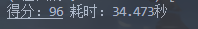

# hdurewords
杭电 我爱记单词 脱机全自动完成 基于GPT4 正确率 95+ 

#使用方法：

1. 打开文件目录 打开cmd窗口
输入 pip install -r requirements.txt
安装完成后 回到根目录

2. 新建一个python文件 输入以下代码 

```python
from rewords import REWORDS

if __name__ == '__main__':
    """
    mode 0 自测 
    	 1 考试
    week 第几周的考试
    dalay 延迟交卷 以分钟为单位  自测可以不管 考试的话建议填写2-4
    """
    user = REWORDS(user_id='', user_password='',
                    mode=0, week=1, delay=0)
    
```

测试结果：

 

 

 

 

 

 

分数大概 95左右 基础时间 30s左右

其中登录补环境是借鉴校友代码：

[Dioxane123/iLoveWord]( https://github.com/Dioxane123/iLoveWord)


最后 本代码完成于 cursor 发布初期 现在 cursor 开始会员制 好在最初的api还可以调用

现在的代码有时会出现bug 希望大佬可以给出写改进意见 🤗🤗🤗
